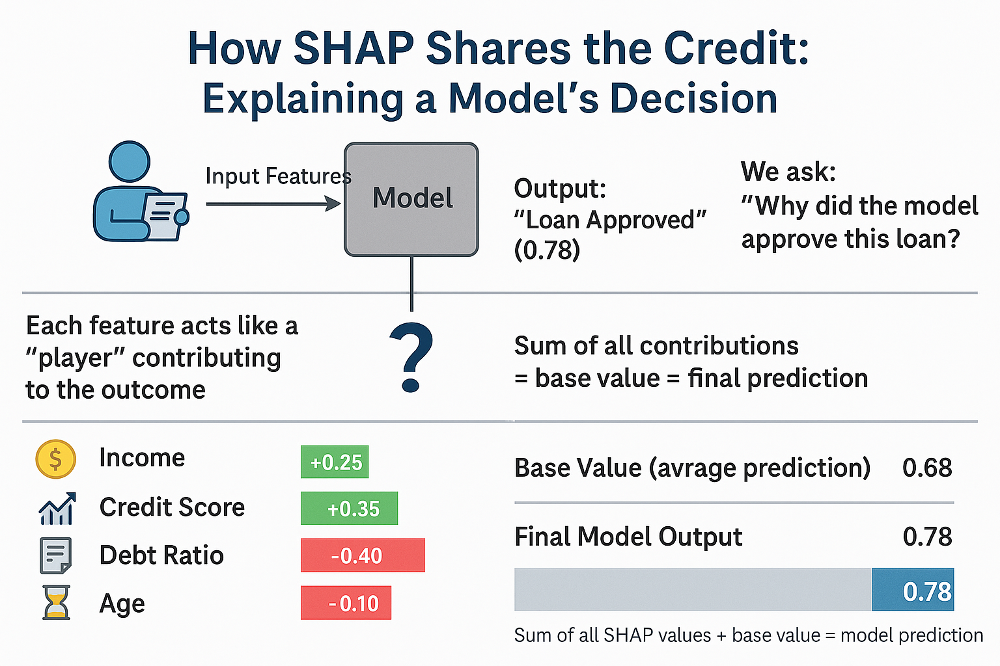
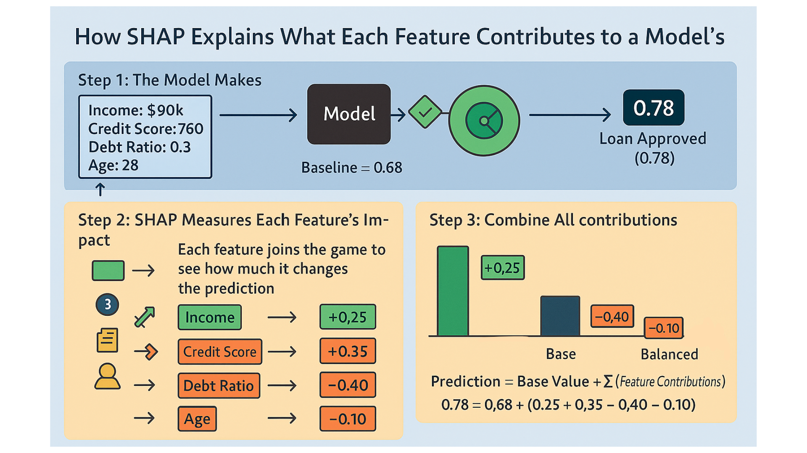

# Human-AI-Interaction
Human-AI Interaction and interpretable or explainable method

## 🧾 Attribution (Use of AI Citation)  

> AI has not been used for this assignment, only editing and graphics tools like canva have been used to design/edit visuals.  

### Method 1: Grad-CAM

**Explanation 1**

>Children’s book explaining the method to a toddler

This children’s book, *“Grady the Camera Learns to See,”* explains **Grad-CAM** in a fun and simple way. Grady, a friendly robot camera, represents a convolutional neural network that highlights which parts of an image it focuses on using red “attention” areas. 

I wanted to make **explainability** feel human, so I added a teacher and kids to show **human-AI collaboration** and **transparency** in action. The story shows how seeing what the model “looks at” helps people trust it more, turning a complex concept into something even a child could enjoy and understand.

[Canva Book submission Link](https://www.canva.com/design/DAG29_wWXDY/QRqjWgHAjtisYHAY4vRINQ/edit?utm_content=DAG29_wWXDY&utm_campaign=designshare&utm_medium=link2&utm_source=sharebutton)

>Note : Also Pdf has been uploaded to this repo of this book `Book GradCAM.pdf`

### Method 2: SHAP

**Explanation 2**

>Figure (diagram, flow chart, etc) to explain the method in a classroom 

Below are the Figures to explain SHAP in a classroom:

